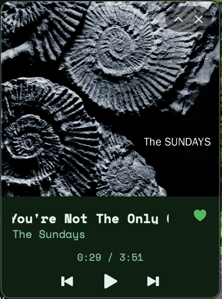
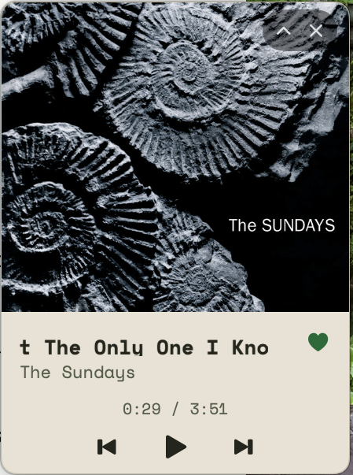
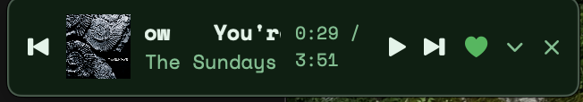
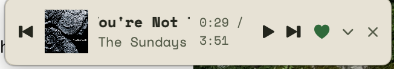

# dA Spotify Mini Player

🚧 **Alpha** — the [v1.0.0 release](https://github.com/peds24/dA-spotify-miniplayer/releases/tag/v1.0.0)
is a first, working-but-rough cut. Expect bugs and breaking changes before a
stable 1.0. See [Liked Songs access](#liked-songs-access) below for a current
limitation on the heart button.

A native macOS floating mini player for Spotify. It sits as a small,
always-on-top, draggable panel showing the current track, with playback
controls and a button to add the current song straight to your Spotify
Liked Songs.

<p align="center">
  
  
</p>
<p align="center">
  
</p>
<p align="center">
  
</p>

## Features

- Floating panel — drag it anywhere on screen, stays on top of other windows
- Compact and expanded layouts, toggled with the chevron on the panel itself
- Live "now playing" info (track, artist, artwork) read directly from the
  Spotify desktop app, with long titles scrolling in a looping marquee
- Playback controls: previous / play-pause / next
- One-click "Add to Liked Songs," with the heart reflecting whether the
  current track is already liked
- Close button right on the panel, alongside the expand/collapse chevron
- Light and dark themes that follow macOS's system appearance automatically
- Lives in the menu bar — no Dock icon; right-click the floating panel itself
  to reach the same menu (Log In/Out, layout, Settings, Quit)
- A dedicated Settings window (⌘,) alongside the menu bar dropdown

## Requirements

- macOS 13.0 or later
- The [Spotify](https://www.spotify.com/download/) desktop app, running

## Install

### Homebrew

```bash
brew tap peds24/tap
brew trust peds24/tap
brew install --cask da-miniplayer
```

This installs the same ad-hoc-signed build attached to the
[v1.0.0 release](https://github.com/peds24/dA-spotify-miniplayer/releases/tag/v1.0.0)
(no paid Apple Developer identity yet, so it isn't notarized — the cask
clears the Gatekeeper quarantine flag on install so it opens normally).

### Manual download

Download `DAMiniPlayer-v1.0.0.zip` from the
[v1.0.0 release](https://github.com/peds24/dA-spotify-miniplayer/releases/tag/v1.0.0),
unzip, and move `DAMiniPlayer.app` to `/Applications`. Since it's unsigned,
right-click the app and choose "Open" the first time instead of double-clicking,
or it'll be blocked by Gatekeeper.

### Liked Songs access

The heart button and Settings' Spotify login run through this app's own
Spotify integration, which Spotify currently caps at a small number of
allow-listed accounts (their "Development Mode" limit) — so for now, liking
songs only works if [@peds24](https://github.com/peds24) has added your
Spotify account to that allow-list; message to be added. Playback controls
and now-playing info don't need this and work for everyone. A future release
will move to Spotify's extended-access mode so anyone can use it.

## Build from source

### 1. Install dependencies

```bash
brew install xcodegen
```

### 2. Create a Spotify app

1. Go to the [Spotify Developer Dashboard](https://developer.spotify.com/dashboard)
   and create an app.
2. Add `da-miniplayer://callback` as a Redirect URI in the app's settings.
3. Copy the app's Client ID.

### 3. Configure the client ID

```bash
cp Sources/DAMiniPlayer/Resources/Config.plist.example Sources/DAMiniPlayer/Resources/Config.plist
```

Edit `Sources/DAMiniPlayer/Resources/Config.plist` and paste in your Client ID.

### 4. Build and run

```bash
xcodegen generate
xcodebuild -project DAMiniPlayer.xcodeproj -scheme DAMiniPlayer -configuration Debug build
```

Then open the built `DAMiniPlayer.app` (find it via `xcodebuild -showBuildSettings`
under `BUILT_PRODUCTS_DIR`), or open `DAMiniPlayer.xcodeproj` in Xcode and run
from there.

On first launch, macOS will prompt you to allow DA Mini Player to control
Spotify — approve it so the mini player can read the current track and
send playback commands.

Click the "♪" menu bar icon and choose "Log In to Spotify" once to enable
the Liked Songs heart button.

## License

Licensed under the [GNU General Public License v3.0](./LICENSE).

Copyright (C) 2026 Pedro Serdio Hank
